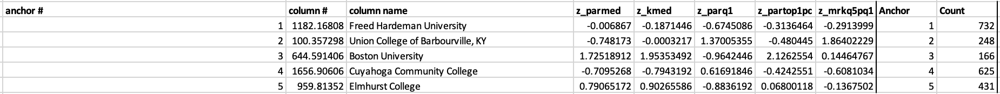

# Custer Analysis on Mobility Rates by College
## Background
Economic mobility is defined when an individual, family or group is able to change their economic status. This movement is measured by income. The initial business question we would like to answer is how universities can use college access and mobility data to create marketing campaigns for targeted students and what can be implemented into these campaigns to try to pull more students in and push students to want to join? If a college is not ranked as a top tier institution, what is a major value proposition that can be used to show that they are still a great university to attend?

## Variable and Metrics Measured
Data was collected using the Opportunity Insights US College Mobility Data. The data showed both parents and children’s income distributions by college. There was data collected from 2202 universities and colleges. The variables chosen for the analysis are as follows:

Name: College/University Name
par_median: Median parent household income
k_median; Median child individual earnings in 2014 (rounded to the nearest $100)
par_q1: Fraction of parents in the Bottom 20% of the income distribution
par_top1pc: Fraction of parents in the Top 1% of the income distribution
mr_kq5_pq1: Mobility Rate: Percent of students who have parents in the Bottom 20% of the income distribution and reach the Top 20% of the income distribution

These variables were selected because it would be interesting to see how parent’s income, child’s earnings 14 years post-graduation, as well as parents income distribution and mobility played a role in the students college of choice. I wanted to see if there was a reason as to why specific universities had certain students or if by even going to university was what was causing students to have positive economic mobility. Were there universities that did not have any impact on the student’s mobility and if so, maybe these universities could use this data to better allow them to move up the ladder. 

## Method of Conducting Analysis
The following are the results from the cluster analysis.

The way these results were calculated were by first assigning each university with a number. Next, we found the average and standard deviations for each of the variables.  We used those numbers to calculate the z-score for each of the variables. We then listed 5 anchor points and used VLOOKUP to pull the university names. We did this to pull the zscore values. We took these zscore values for each variable and used them to find the difference between z scores of the variables. And then used the MIN function to find which was the smallest value. The MATCH function was then used to find the which anchor it was associated with. We concluded by running the solver function setting the parameters to include all integers and functions between 1 and 2202 which ultimately generated the findings to have the smallest sum of minimum distances. 

## Findings: After 14 years of working 

This first cluster is around Freed Hardeman University. The median parent household income sits around the average and there is a slight decrease in the mean earnings for that of these students also. The students in this group have parents that face negative economic mobility as well as the child regardless of going to school is affected and is faced with negative economic mobility. The positive out take on this cluster is that most students while they might not move up in economic mobility they tend to hang around the average.

The second cluster is around Union College of Barbourville, KY. This cluster is very interesting as parents are 1 standard deviation below  the mean with regards to earnings however their child ends up have an average earnings. What is interesting to see is that the parents are also moving up the economic mobility ladder at an increase in close to 2 standard deviations. The people that attend these institutions are looking to seek careers that pay more year after year.

The third cluster is around Boston University. This data groups the top tier institutions showing that parent income and student income are 2 standard deviations above the mean which makes sense as these are the cream of the crop students and probably parents. Parents are not found in the bottom 20% of the income distribution and more than 2 standard deviation from the mean are parents in the top 1%. These are premier schools with parents with high incomes. What is still interesting to see is that although these parents have high incomes, they still are gaining economic mobility.

The fourth cluster is around Cuyahoga Community College. These children do not gain economic mobility and from these findings college can but a financial burden on both the student and parent's economic mobility.

The fifth cluster is around Elmhurst College. These parents are well off (middle class) Tend there children tend to be just like them at close to one standard deviation above the mean. Slight negative movement in social mobility.

## Conclusion 
Universities that share similar characteristics to that of Union College of Barbourville, KY can create marketing material for students that come from lower socioeconomic backgrounds and show them that by going to their school they will be able to have nicer jobs, live in nicer cities and live the American Dream. This analysis did a great job showing that there are schools that have a positive economic mobility for students, however it was interesting to see that these schools that had a positive economic mobility for students also had parents that were moving from the bottom 20% of the economic distribution to the top 20%. This could mean that the parents are hardworking are looking for an education that delivers the rigor they are looking for. These attributes are what universities such as Union College of Barbourville, KY can use to drive in more talented students. 
